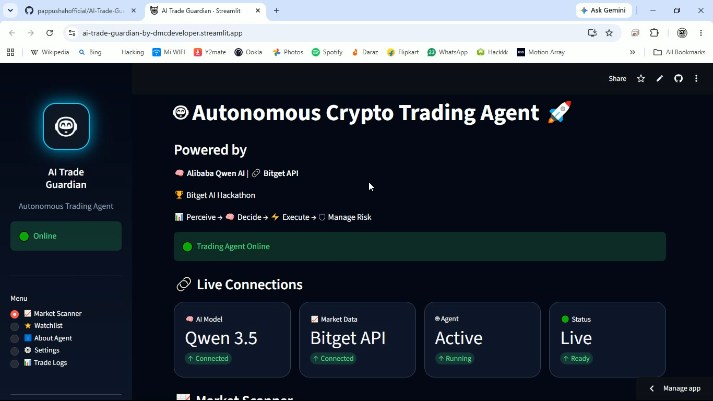
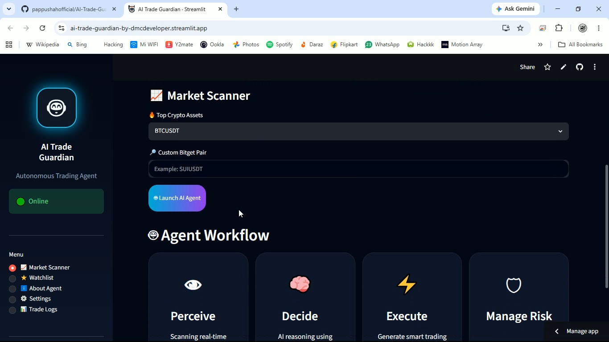
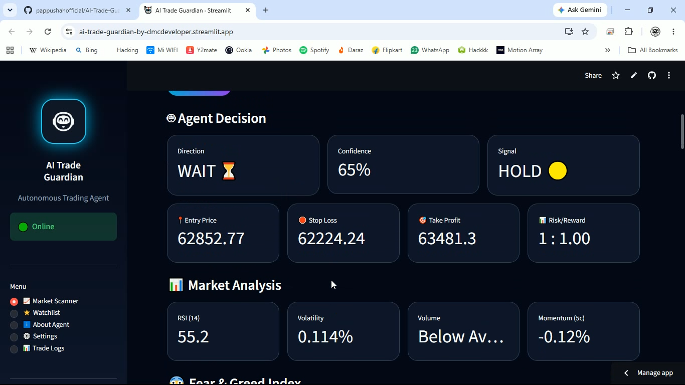
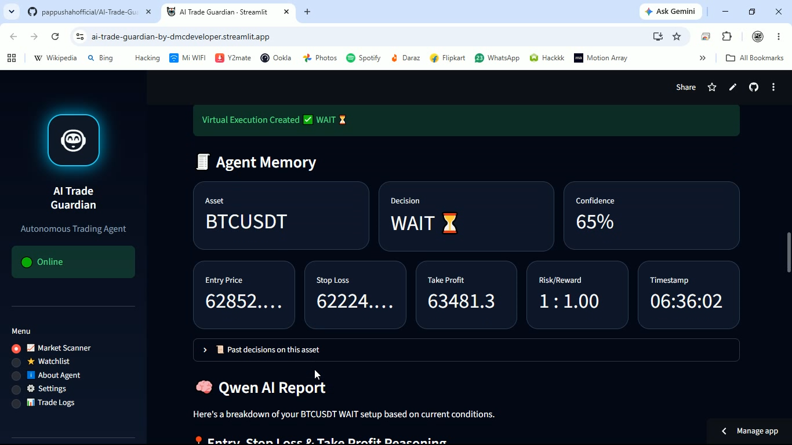
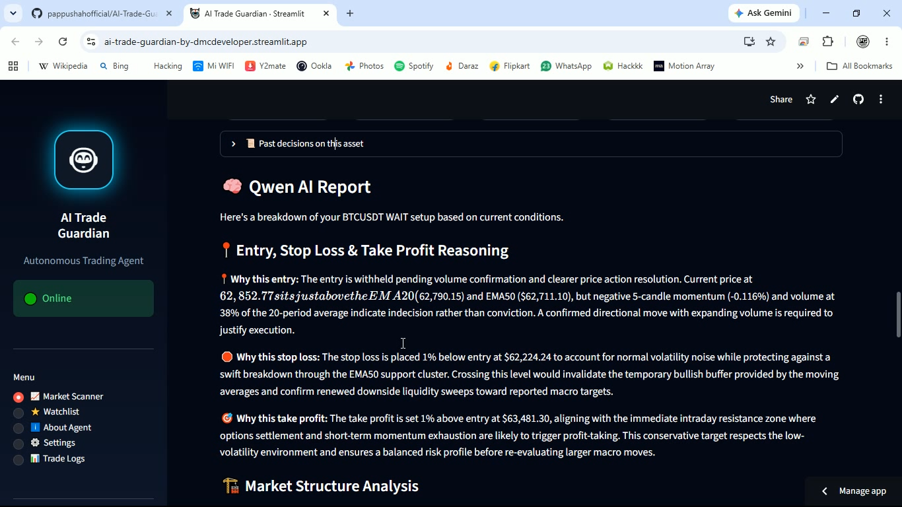
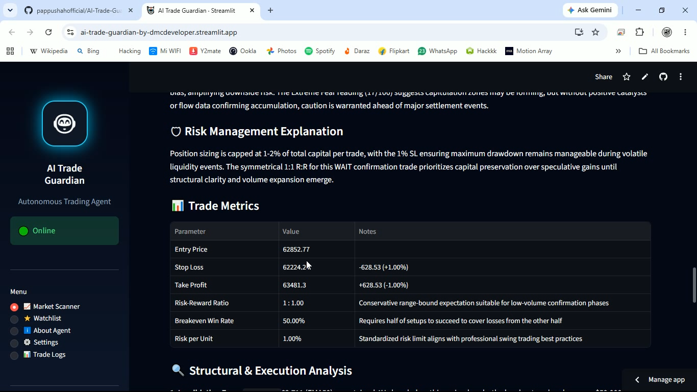

# 🤖 AI Trade Guardian

## Autonomous AI-Powered Crypto Trading Agent 🚀

### Powered by Alibaba Qwen AI + Bitget API  
🏆 Built for Bitget AI Hackathon

---

# 🚀 Overview

AI Trade Guardian is an autonomous crypto trading agent that combines real-time Bitget market data, technical indicators, market sentiment, AI reasoning, virtual execution, risk management, and persistent memory.

The agent follows a complete AI workflow:

👁 Perceive → 🧠 Analyze & Decide → ⚡ Execute → 🛡 Manage Risk → 🧾 Remember

It helps traders understand market conditions using AI-powered reasoning instead of emotional decision making.

---

# 🔗 Project Links

🌐 Live Demo (Streamlit):  
https://ai-trade-guardian-by-dmcdeveloper.streamlit.app/

💻 Source Code (GitHub):  
https://github.com/pappushahofficial/AI-Trade-Guardian

---

# 🤖 Agent Workflow

## 👁 PERCEIVE
- Live Bitget market data
- Price action analysis
- EMA trend detection
- RSI analysis
- Volume analysis
- Market volatility tracking
- Crypto news context
- Fear & Greed sentiment data

## 🧠 ANALYZE & DECIDE

Alibaba Qwen AI evaluates:

- Technical indicators
- Market structure
- News sentiment
- Market emotion
- Agent memory

Generates:

- LONG 📈
- SHORT 📉
- WAIT ⏳
- Confidence score
- Detailed reasoning

## ⚡ VIRTUAL EXECUTION CENTER

- Entry price planning
- Risk validation
- Virtual trade execution
- Decision tracking
- Memory storage

(No real exchange orders are placed)

## 🛡 RISK MANAGEMENT

- Stop Loss calculation
- Take Profit targets
- Risk / Reward ratio
- Execution checklist
- Risk controls

## 🧾 AGENT MEMORY

Stores:

- Previous decisions
- Entry price
- Stop Loss
- Take Profit
- Confidence score
- AI reasoning
- Trade history

---

# 🧠 AI Decision Sources

✅ Bitget Live Market Data  
✅ EMA + RSI Indicators  
✅ Volume Analysis  
✅ Market Volatility  
✅ Crypto News Sentiment  
✅ Fear & Greed Index  
✅ Alibaba Qwen AI Reasoning  
✅ Agent Memory  

---

# ✨ Features

✅ Alibaba Qwen AI Integration  
✅ Bitget Market API Integration  
✅ Real-Time Market Scanner  
✅ Custom Bitget Pair Support  
✅ Live Agent Status Monitor  
✅ Confidence Tracking  
✅ Interactive Charts  
✅ Market Structure Analysis  
✅ AI Generated Trading Reports  
✅ Entry / SL / TP Reasoning  
✅ Trade Metrics Dashboard  
✅ Virtual Execution Center  
✅ Persistent Agent Memory  
✅ Trade Logs  
✅ Smart Error Handling  

---

# 📸 Screenshots

## 🚀 AI Trade Guardian Dashboard

## 📊 Market Scanner & Agent Workflow

## 🤖 AI Decision & Market Analysis

## ⚡ Virtual Execution & Agent Memory

## 🧠 Alibaba Qwen AI Reasoning Report

## 🛡 Risk Management & Trade Metrics

---

# 🏗 Tech Stack

- Python 🐍
- Streamlit 🌐
- Alibaba Qwen AI 🧠
- Bitget API 📡
- Pandas
- Plotly
- SQLite

---

# 🔐 Security

- API keys stored using environment variables / Streamlit Secrets
- No private API keys stored in source code
- Secure deployment configuration

---

# 📊 Supported Markets

- BTCUSDT
- ETHUSDT
- BGBUSDT
- SOLUSDT
- BNBUSDT
- XRPUSDT
- DOGEUSDT
- ADAUSDT
- AVAXUSDT
- LINKUSDT

Supports custom Bitget trading pairs.

---

# 🧩 Architecture

Bitget Market API  
⬇️  
Market Intelligence Engine  
⬇️  
Technical + Sentiment Analysis  
⬇️  
Alibaba Qwen AI Reasoning  
⬇️  
Agent Decision Engine  
⬇️  
Virtual Execution Center  
⬇️  
Risk Management Engine  
⬇️  
Agent Memory System  

---

# 🎯 Goal

AI Trade Guardian demonstrates autonomous AI trading assistance through:

- Real-time market perception
- AI-powered reasoning
- Risk management
- Virtual execution
- Continuous memory

The goal is to assist traders with intelligent market analysis, not replace human decision making.

---

# ⚠️ Disclaimer

AI Trade Guardian provides AI-powered market analysis only.

Educational and research purpose project.

Not financial advice. Crypto trading involves risk.

---

# 👨‍💻 Developer

Created by **Pappu Shah DMC Developer**

Telegram: https://t.me/PappuShahOfficial  

GitHub: https://github.com/pappushahofficial

---

# 🏆 Built For

Bitget AI Hackathon

AI Agent × Crypto Trading × Market Intelligence 🚀
